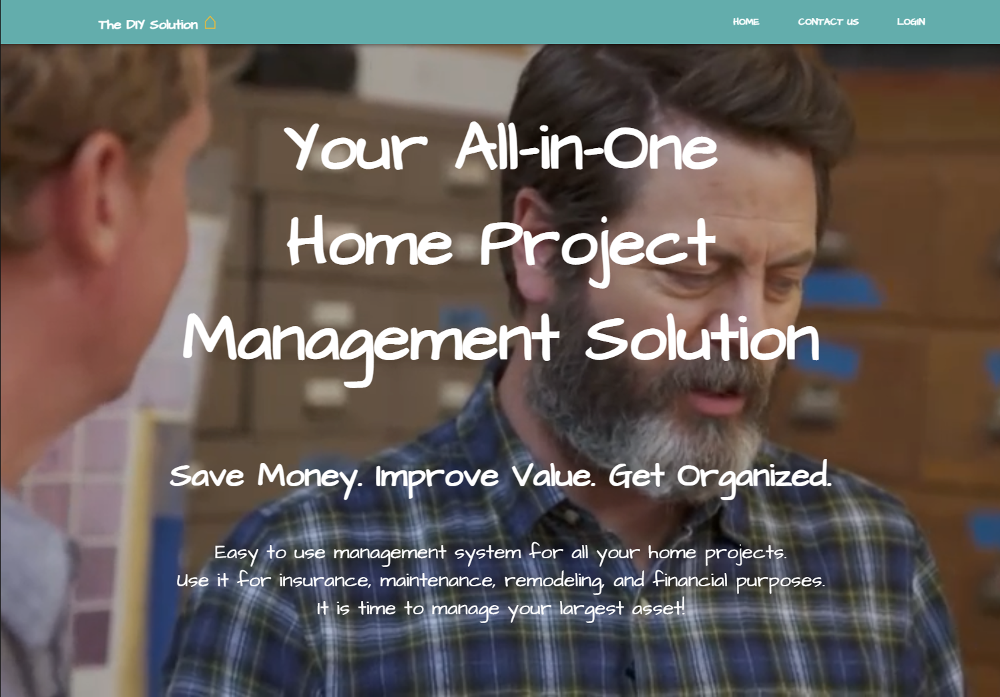
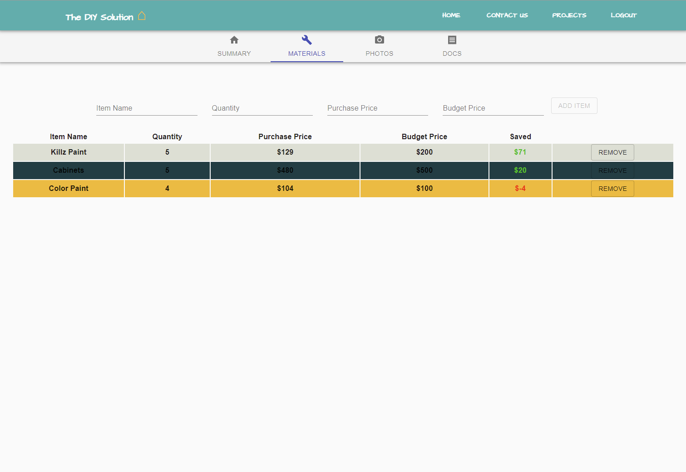

# The DIY Solution 

## Table of Contents

- [Description](#description)
- [Team](#team)
- [Technology Used](#technology)
- [Resources](#resources)
- [Challenges](#challenges)
- [Licensing Information](#licensing)
- [Screenshots](#screenshots)
- [GIF Demonstration](#demonstrations)
   
   

## Description

This is a full-stack web application using the MERN stack: MongoDB, Express, React, and Node. The purpose of the application is to provide users with the ability to organize and keep track of finances for their personal home projects.

When the user visits the application, they will see the home page. In the navbar are links for Home, Contact Us, and Login. When the user clicks Login, they will be taken to the Login screen to login with username and password, or Google, Facebook, or even Twitter. If the user does not yet have an account, there is a Sign Up link to sign up.

Once the user is logged in, they will be taken to the project landing page. There is a Create New Project button at the top of the page that will open a modal for the user to enter the title of their project, a brief description, as well as the budget. Below the Create New Project button the user will see a grid of their projects. Each grid item has the name of the project, a description of the project, and a delete button. The user can use the Delete Project button to delete the project.

The user may click on the title of each project to go to a project detail page. On the project detail page are tabs: Summary, Materials, Photos, and Docs. On the Summary tab, the user can view the title of their project, the budget, cost to date, and balance remaining in budget.

On the Materials tab, the user may enter in a project item, quantity, purchase price, and budget price. There is a column that displays how much the user saved or did not save on their budget with each item to decide if they can devote more of the budget to other items.

In the future, the user will be able to upload before, progress, and after photos of their projects on the Photos tab, and be able to upload receipts and other information on the Docs tab.

### Please follow [this link](https://warm-caverns-74106.herokuapp.com/) to view the live application.

 

## Team

- [Alexander Vadeboncoeur](https://github.com/Alexva397): Alex was the champion of Passport.js and all user authentication. He protected backend routes and worked on preventing non logged-in users from viewing pages meant only for logged-in users. He utilized the Passport Local Strategy as well as Google, Facebook, and Twitter strategies. Alex also created a loading page the user sees while the application is loading in the user.
- [JP Eiler](https://github.com/jpeiler97): JP set up the backend server, routes, database, models, and seed file. JP also set up the landing page where users create a new project and view their saved projects. JP created a custom algorithm to cycle through colors for the project cards on the project landing page. JP also helped with some styling on project summary page. JP also created an Edit button on the project landing page that enables/disables the project delete button for two-factor security on deleting projects.
- [Katie Patterson](https://github.com/ktp1451): Katie created the wireframe designs for the entire application. All team members followed her design when building their parts of the application. Katie also built the home page and footer. She was able to implement a live video background for the home page.
- [Katy Chadwell](https://github.com/klay824): Katy created the project detail page and the tabs. She also created aggregation on the backend in order to manipulate the database to view extra details, such as budget balance and total amount spent. Katy also worked on getting a photo upload feature working and it is still a work-in-progress.

## Technology

- MongoDB
- Mongoose
- Express.js
- React.js
- Node.js
- Aggregation
- Material-UI
- Passport Local Strategy
- Passport Google Strategy
- Passport Facebook Strategy
- Passport Twitter Strategy

 
 

## Resources

- [Mongoose Schema Types](https://mongoosejs.com/docs/schematypes.html)
- [React Documentation](https://reactjs.org/)
- [Passport.js](http://www.passportjs.org/)
- [Material-UI Documentation](https://material-ui.com/)
- [Import Video as a Background](https://www.youtube.com/watch?v=I2UBjN5ER4s&list=PLOQsaN6kJ6BrcAsj9Fhe5pj8dxNn9RFKp&index=4&t=80s)
- [Responsive Navbar Tutorial](https://betterprogramming.pub/making-a-basic-header-responsive-with-materialui-and-react-2198fac923c8)
- [MongoDB Aggregation Documentation](https://docs.mongodb.com/manual/aggregation/)

   
   

## Challenges

Some of the challenges we faced was trying to get a photo upload to work We were able to get photos uploading to MongoDB, however, it was saving to a folder which is not supported by Heroku. Some progress was made to uploading a photo to Cloudinary for hosting, though despite getting a 200 response, the image was not appearing on Cloudinary. More testing needed.

Another challenge was getting new items to show up on the project detail page without requiring a page refresh. We ran into issues with our data structure not playing nicely with the .map() function in this instance.

## Licensing Information

This project is covered under the MIT license.

## Screenshots

## Demonstrations

### Login

### Create New Project

### Delete Project

### Enter/Delete Item

### Over Budget!

